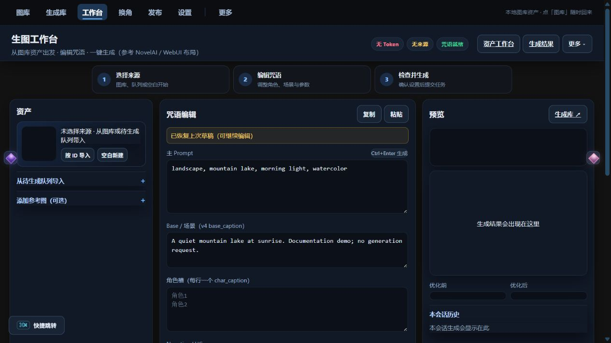

# Nai学长工作室

管理本地 NovelAI 图库、提示词和生成任务的 Windows 工具。它把素材检索、参数编辑、批量生成、后处理和投稿准备放在同一个界面中，图片和任务记录保存在本机。

[English](README_EN.md) · [Windows 下载](https://github.com/h1neolzr7f/NaiXueZhang-Studio-Upgrade/releases/tag/v1.5.2) · [使用指南](docs/user-guide.md) · [版本变化](docs/UPGRADE.md)

本仓库是 **v1.5.2 当前维护线**；旧的 v1.4 保留在 [NaiXueZhang-Studio](https://github.com/h1neolzr7f/NaiXueZhang-Studio)。Windows 发布包不包含 Android APK。

## 界面预览



在无账号、空图库环境下运行当前源码后截取。图中提示词是手工输入的演示文本，没有发起生成请求，也没有调用付费接口；右侧为空是因为本次没有生成图片。环境、复现步骤和测试范围见[验证记录](docs/verification-2026-08-31.md)。

## 主要功能

- **图库与来源**：导入本地图片、解析 NovelAI 元数据，按作品、作者、标签和提示词检索。来自第三方平台的素材需要用户具有相应使用权。
- **提示词与生成**：编辑场景和角色参数，管理草稿、换角预检与批量任务。生成任务保存参数快照，便于回看当时提交的内容。
- **任务与结果**：将生成记录和文件分开管理，按源作品归档；提供后处理、回收站和投稿准备入口。
- **可选外部服务**：NovelAI 生成、素材发现、助手及发布功能需要对应配置。未配置账号也可以启动界面，但不能完成这些外部操作。

NovelAI、Pixiv 等均为第三方服务，本项目没有官方隶属或合作关系。服务可用性、账户资格和费用以相应平台为准。

## 开始使用

### Windows 发布包

1. 从 [v1.5.2 Release](https://github.com/h1neolzr7f/NaiXueZhang-Studio-Upgrade/releases/tag/v1.5.2) 下载完整包，按发布说明核对 SHA-256。
2. 完整解压到可写目录，双击 `一键启动.bat`。
3. 打开 `http://127.0.0.1:8797/`。运行数据保存在程序目录下的 `data/`；配置外部账号前，可先浏览工作台和设置说明。

### 从源码运行

建议使用 Windows 与 Python 3.13，在 PowerShell 中执行：

```powershell
git clone https://github.com/h1neolzr7f/NaiXueZhang-Studio-Upgrade.git
cd NaiXueZhang-Studio-Upgrade
py -3.13 -m venv .venv
.\.venv\Scripts\python.exe -m pip install -r requirements.core.lock.txt
.\.venv\Scripts\python.exe server.py
```

默认入口是 `http://127.0.0.1:8797/`，另一个工作区入口为 `/app`。源码运行使用仓库内的静态资源；修改 `frontend/` 后才需要 Node.js 20+ 重新构建：

```powershell
npm --prefix frontend ci
npm run workspace:build
python scripts/asset_versions.py
```

核心依赖用于本地服务。助手、浏览器发布和部分后处理功能还需要各自的依赖与配置，见[使用指南](docs/user-guide.md)。不要把基本页面启动成功当成全部集成已经可用。

## 值得查看的实现

| 位置 | 内容 |
| --- | --- |
| `routes/`、`server.py` | FastAPI 路由与本地服务入口 |
| `db.py`、`gallery_catalog.py` | SQLite、全文检索与图库索引 |
| `generation_jobs.py`、`production_queue.py` | 生成任务状态、参数与队列持久化 |
| `nai/`、`butler/` | 生成接口和助手实现；顶层模块保留兼容入口 |
| `web/`、`frontend/` | 经典页面与 React / TypeScript 工作区 |
| `tests/`、`scripts/` | 回归测试、打包和发布检查 |

这里比较在意的是失败后的状态是否说得清楚。例如，生成请求已经发出，但响应丢失时，不能直接认定“没有扣费”再重试。项目为未知结果保留状态，由用户核对；不把它显示为成功。

## 生成与数据边界

- 工作台和换角默认约束在项目配置的免费档参数范围内。这不代表任何账号都能免费使用，也不是免扣费保证。
- 提交时固定提示词参数；对已收到 HTTP 5xx 响应或扣费状态未知的任务，不自动重复提交。其他错误的处理以具体任务状态和实现为准。
- 批量换角先预览再执行；重启后的未发送任务与已经发送但结果未知的任务需要区别处理。
- 服务默认监听 `127.0.0.1`，写接口使用本地会话令牌；Windows 上的凭据落盘使用 DPAPI。这些措施不等于完整的多用户认证，不建议直接暴露到公网。
- 本地保存不代表所有操作离线：生成、助手、采集和投稿可能向所配置的服务发送必要数据。使用前请检查账号、提示词和素材的范围。

## 开发与验证

安装核心依赖后，可以先运行不需要真实账号的选定回归测试：

```powershell
.\.venv\Scripts\python.exe -m pip install pytest
.\.venv\Scripts\python.exe -m pytest -q tests/test_backend_persistence_contracts.py tests/test_qq_nai_metadata.py tests/test_batch_preview_dedup.py
```

2026-08-31 的本地检查为 **31 passed**。这是选定测试结果，不是全量通过声明，也不包含付费生成或安装包验收。详细环境见[验证记录](docs/verification-2026-08-31.md)；完整 CI 配置见[测试工作流](.github/workflows/tests.yml)。

更大范围的开发检查和前端改动说明见 [CONTRIBUTING.md](CONTRIBUTING.md)。不要对整个目录直接执行 `compileall`，以免扫描本地运行环境和数据。

## 反馈、贡献与许可

Bug 请附版本、系统、最小复现步骤和脱敏日志。修复、回归用例、文档与可用性改进都可以提交；较大改动先说明问题和范围。后续计划见 [ROADMAP.md](ROADMAP.md)。

不要在 Issue、PR 或截图中提交 Token、Cookie、私人数据库及未经授权的图片。安全问题请按 [SECURITY.md](SECURITY.md) 报告。

代码采用 [MIT License](LICENSE)，不授予第三方素材、角色、商标或平台数据的权利。更多说明见[负责任使用](RESPONSIBLE_USE.md)与[免责声明](DISCLAIMER.md)。
