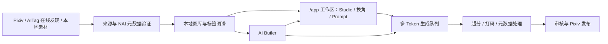

<div align="center">

# 🐾 Nai学长工作室

### 升级版 · 本地优先的 NovelAI 生产工作台

**素材发现 · NAI 元数据验证 · `/app` 工作区 · 角色换角 · 批量生成 · 后处理 · Pixiv 发布**


[升级版仓库](https://github.com/h1neolzr7f/NaiXueZhang-Studio-Upgrade) ·
[稳定版 v1.4.0](https://github.com/h1neolzr7f/NaiXueZhang-Studio/releases/tag/v1.4.0) ·
[升级说明](docs/UPGRADE.md) ·
[路线图](ROADMAP.md) ·
[参与贡献](CONTRIBUTING.md) ·
[责任与来源](RESPONSIBLE_USE.md)

</div>

> [!IMPORTANT]
> **非官方项目。** 本项目与 pixiv Inc.、NovelAI（Anlatan Inc.）及其他第三方平台不存在隶属、授权或合作关系。使用者应自行确认访问、下载、处理与发布行为符合适用法律、平台规则及第三方权利要求。维护者不为绕过访问控制、干扰平台运行、未经授权的数据采集或侵权传播提供支持。详见 [免责声明](DISCLAIMER.md) 与 [负责任使用说明](RESPONSIBLE_USE.md)。

> [!NOTE]
> **本仓库是升级版源码主干**（v2.0.0）。主界面切到 `/app` 工作区，后端拆成 `nai/`、`butler/` 等模块。  
> 需要已经打好的 Windows 一键包时，请仍从稳定版下载 **[v1.4.0 修复版](https://github.com/h1neolzr7f/NaiXueZhang-Studio/releases/tag/v1.4.0)**，并用发布说明中的 SHA-256 核对压缩包。升级版一键包尚未从本仓库发布。

## 与稳定版的关系

| | 稳定版 | 本仓库（升级版） |
|---|---|---|
| 仓库 | [`NaiXueZhang-Studio`](https://github.com/h1neolzr7f/NaiXueZhang-Studio) | [`NaiXueZhang-Studio-Upgrade`](https://github.com/h1neolzr7f/NaiXueZhang-Studio-Upgrade) |
| 定位 | 已发布的 v1.4.0 修复版 | 工作区与结构升级后的开发主干 |
| 主入口 | 经典图库 `/` | `/app` 工作区（经典页仍保留） |
| 一键 Windows 包 | [Releases](https://github.com/h1neolzr7f/NaiXueZhang-Studio/releases) | 尚未发布；请从源码运行 |
| 付费出图闸门 | v1.4.0 已落地 | 保持并沿用到工作区批量路径 |

完整对照见 [docs/UPGRADE.md](docs/UPGRADE.md)。

## 升级版做了什么

相对 v1.4.0：

- **`/app` 成为主工作区**：图库、生成库、工作台、小镜、换角、爬虫、分类、发布都在同一套导航里，不再把常用工具只留在经典 HTML。
- **分类、批量换角、浏览器投稿进工作区**：标签分面、队列批量预检、Pixiv 上传 / 一键起号都走现有 API；付费生成默认 `force_free`，必须先零费用预检。
- **后端拆分**：`nai_api.py`、`butler_service.py` 改为 facade；实现放在 `nai/`、`butler/`。`ButlerWorkflowRuntime` 的长循环在 `workflow_executors.py`。
- **付费路径没有放宽**：点一次冻结 Prompt；HTTP 5xx 有响应时不自动重试；`unknown` / 崩溃恢复默认不重试；工作区禁止裸 `fetch(`，统一走 `ApiClient`。

## 它解决什么问题？

AI 绘图的难点往往不是“生成一张图”，而是长期管理数千张素材、Prompt、角色、来源、任务和发布记录。

Nai学长工作室把原本分散在浏览器、文件夹、脚本和多个工具中的流程，整理成一套可恢复、可检索、可追踪的本地工作台：



## 界面预览

当前深色工作台。经典图库仍可用；升级版启动后请优先使用 `/app`。

<p align="center">
  
</p>

<p align="center">
  
  &nbsp;
  
</p>

## 核心能力

| 能力 | 说明 |
|---|---|
| **严格 NAI 准入** | 逐页解析图片元数据，仅将可验证的 NovelAI 作品纳入目标图库 |
| **本地优先** | 图片、数据库、配置和任务状态默认保存在本机，不上传用户图库 |
| **`/app` 工作区** | 图库筛选、工作台出图、生成库、换角、小镜、爬虫、分类、发布、设置、导演台、后处理、运营与合规 |
| **Prompt 与角色资产** | 搜索原始 Prompt、角色、作品、画师、动作、服装、场景与构图标签 |
| **批量创作** | 角色换角预检、生成队列、多 Token 调度、失败恢复；默认免费档，付费需确认 |
| **后处理闭环** | 超分、打码、元数据清理与发布前检查 |
| **AI Butler** | 解答只读；检修只跑具名剧本；生产（生成 / 投稿准备 / 采集）必须确认工单 |
| **Pixiv 发布** | 多账号、浏览器登录、选择器探测、组上传与一键起号；打开的是本机 Chrome，不是 Anlas |
| **来源追踪** | 保存作者、作品链接、源状态和作者声明，可导出来源清单 |

## 工作区入口

服务启动后打开：

```text
http://127.0.0.1:8797/app
```

主导航（8 项）指向工作区：图库、生成库、工作台、小镜、换角、爬虫、分类、发布。导演台、后处理、运营、合规在工作区附加导航；经典 HTML 仍可通过「更多」打开，供书签和完整 atlas 使用。

## 付费出图约定

这些规则在升级版中仍然有效，工作区不会绕过：

- 点击生成时冻结当时的 Prompt 快照（`frozen_comment`）；
- 默认 `force_free=true`，付费出图需要明确确认；
- NovelAI HTTP 5xx 有响应时不自动重试；
- 任务状态为 `unknown` 或 `recovered_after_restart` 时，不把这次当成「没扣费」再自动重试；
- 导演台必须先零费用预检，再带 `confirmed` 与 `preview_id` 启动；
- 批量换角同样先 `/batch/preview`，再 `/batch/run`。

## 快速开始

### 方式一：稳定版一键包（推荐日常安装）

从 [稳定版 Releases](https://github.com/h1neolzr7f/NaiXueZhang-Studio/releases) 下载 **v1.4.0** 便携包。解压后双击「一键启动.bat」。程序默认打开：

```text
http://127.0.0.1:8797/
```

运行数据在程序同目录的 `data/`。发行包不包含 Token、Cookie、图库或本地数据库。

### 方式二：从本仓库源码运行升级版

需要 Windows 10/11 与 Python 3.13：

```powershell
git clone https://github.com/h1neolzr7f/NaiXueZhang-Studio-Upgrade.git
cd NaiXueZhang-Studio-Upgrade
python -m venv .venv
.\.venv\Scripts\Activate.ps1
python -m pip install -r requirements.core.lock.txt
python server.py
```

浏览器打开 `http://127.0.0.1:8797/app`。

修改 `frontend/` 后需要 Node.js 20+ 做**构建**（运行时不需要 Node）：

```powershell
npm run workspace:build
python scripts/asset_versions.py
```

产物写入 `web/app/workspace.js` 与 `web/app/workspace.css`。

## 技术结构

```text
FastAPI localhost service
├─ routes/                 API 与页面路由
├─ web/                    经典 HTML / 静态资源
├─ web/app/                预编译工作区（Vite 产物）
├─ frontend/               工作区 TypeScript 源码
├─ nai/                    NovelAI Token、生成、导演实现
├─ butler/                 小镜规划、执行、工作流运行时
├─ nai_api.py / butler_service.py   兼容 facade
├─ db.py                   SQLite、FTS 与迁移
├─ pixiv_*                 素材发现、账号与发布
├─ scripts/                验证、打包、敏感信息扫描
└─ tests/                  后端、前端契约、安全与持久化回归
```

关键工程特性：

- SQLite FTS 与大型图库索引；
- 任务持久化、断点恢复和原子文件写入；
- Windows DPAPI 本地凭据加密（非 Windows 拒绝把密钥明文写入 `data/`）；
- localhost 写操作会话令牌（失败则拒绝写入）；
- 付费生图任务持久化：5xx 不自动重试、崩溃标扣费未知；
- 更新包 HTTPS + SHA-256 校验；
- 路径越界保护与文件体积限制。

## 隐私与安全

- 服务默认仅监听 `127.0.0.1`；
- NovelAI Token 与 Pixiv refresh token 在 Windows 上通过 DPAPI 加密落盘；
- 本地图库、Prompt、生成记录不上传到项目服务器；
- 工作区前端禁止裸 `fetch(`，统一使用带会话令牌的 `ApiClient`；
- 发布包会排除图片、数据库、缓存、凭据和本地运行日志。

安全问题请不要在公开 Issue 中粘贴 Token、Cookie、完整路径或私人素材，参见 [SECURITY.md](SECURITY.md)。

## 测试

```powershell
python -m pip install -r requirements.core.lock.txt pytest
python -m pytest -q --ignore=tests/test_pixiv_selector_probe.py
python scripts/scan_sensitive.py
```

请勿对整个工作区执行 `python -m compileall .`：它会走进本地 `runtime/`。CI 已排除该目录。

## 贡献

欢迎提交 Bug 修复、测试、大图库性能、工作区可用性与文档改进。开始前请阅读 [CONTRIBUTING.md](CONTRIBUTING.md)。

不要在 PR、Issue、测试数据或截图中提交第三方受版权保护的图片、真实凭据或私人运行数据。

## 路线图

升级版已完成的结构工作见 [docs/UPGRADE.md](docs/UPGRADE.md)。后续方向（配方血缘、参数实验室、相似图等）见 [ROADMAP.md](ROADMAP.md)。

## 许可

代码采用 [MIT License](LICENSE)。代码许可不授予任何第三方图片、Prompt、角色、商标或平台数据的权利。

本项目按现状提供。完整边界见 [DISCLAIMER.md](DISCLAIMER.md)。

---

<div align="center">

**Nai学长工作室 · 升级版 v2.0.0** · 源码主干  
稳定安装包请使用 [v1.4.0](https://github.com/h1neolzr7f/NaiXueZhang-Studio/releases/tag/v1.4.0) 并核对 SHA-256。

</div>
