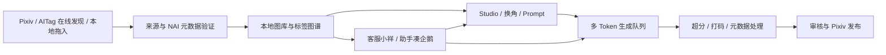
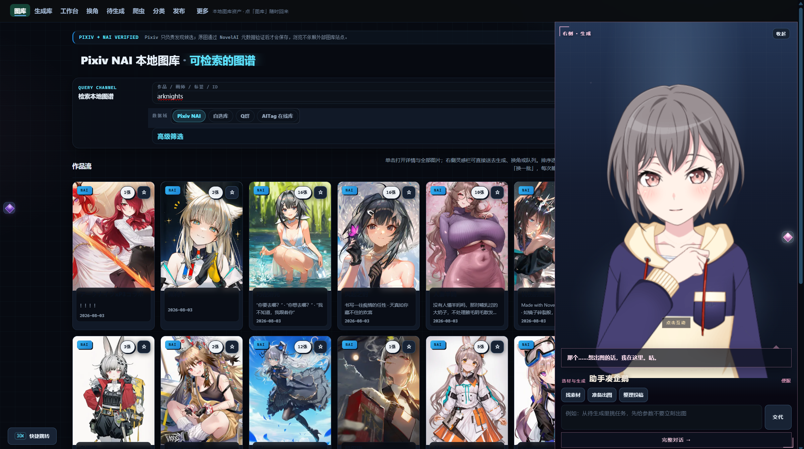
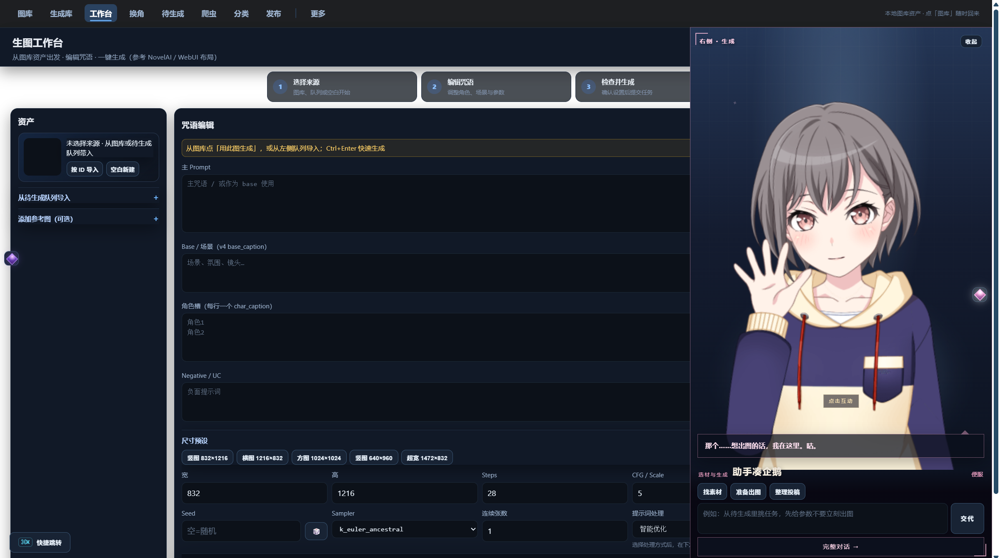
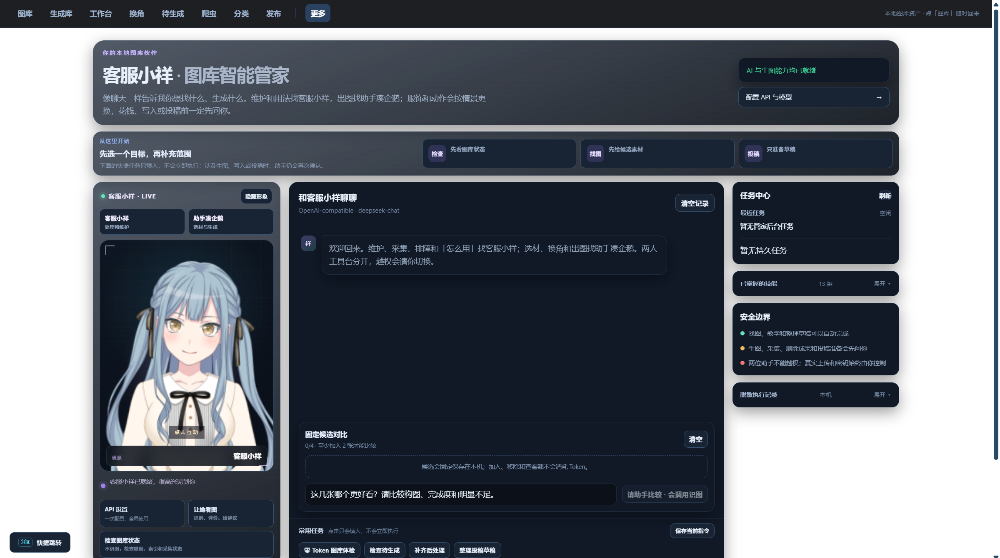

<div align="center">

# 🐾 Nai学长工作室

### 升级版 v1.5.0 · 本地优先的 NovelAI 生产工作台

**素材发现 · NAI 元数据验证 · 图库拖入 · 侧栏助手 · 角色换角 · 批量生成 · 后处理 · Pixiv 发布**


[升级版 v1.5.0 一键包](https://github.com/h1neolzr7f/NaiXueZhang-Studio-Upgrade/releases/tag/v1.5.0) ·
[稳定版 v1.4.0](https://github.com/h1neolzr7f/NaiXueZhang-Studio/releases/tag/v1.4.0) ·
[升级说明](docs/UPGRADE.md) ·
[使用指南](docs/user-guide.md) ·
[路线图](ROADMAP.md) ·
[参与贡献](CONTRIBUTING.md) ·
[责任与来源](RESPONSIBLE_USE.md)

</div>

> [!IMPORTANT]
> **非官方项目。** 本项目与 pixiv Inc.、NovelAI（Anlatan Inc.）及其他第三方平台不存在隶属、授权或合作关系。使用者应自行确认访问、下载、处理与发布行为符合适用法律、平台规则及第三方权利要求。维护者不为绕过访问控制、干扰平台运行、未经授权的数据采集或侵权传播提供支持。详见 [免责声明](DISCLAIMER.md) 与 [负责任使用说明](RESPONSIBLE_USE.md)。

> [!NOTE]
> **本仓库发布升级版 v1.5.0。** 默认打开经典图库 `http://127.0.0.1:8797/`，`/app` 工作区仍可用。  
> Windows 一键包请从本仓库 [Releases](https://github.com/h1neolzr7f/NaiXueZhang-Studio-Upgrade/releases/tag/v1.5.0) 下载，并用发布说明中的 SHA-256 核对压缩包。需要冻结的 v1.4.0 修复版时，请到 [稳定版仓库](https://github.com/h1neolzr7f/NaiXueZhang-Studio/releases/tag/v1.4.0)。

## 与稳定版的关系

| | 稳定版 | 本仓库（升级版） |
|---|---|---|
| 仓库 | [`NaiXueZhang-Studio`](https://github.com/h1neolzr7f/NaiXueZhang-Studio) | [`NaiXueZhang-Studio-Upgrade`](https://github.com/h1neolzr7f/NaiXueZhang-Studio-Upgrade) |
| 定位 | 已冻结的 v1.4.0 修复版 | 当前维护线，现发布 **v1.5.0** |
| 默认入口 | 经典图库 `/` | 经典图库 `/`（`/app` 工作区保留） |
| 一键 Windows 包 | [v1.4.0](https://github.com/h1neolzr7f/NaiXueZhang-Studio/releases/tag/v1.4.0) | **[v1.5.0](https://github.com/h1neolzr7f/NaiXueZhang-Studio-Upgrade/releases/tag/v1.5.0)** |
| 付费出图闸门 | v1.4.0 已落地 | 保持，并覆盖工作区与批量换角 |

完整对照见 [docs/UPGRADE.md](docs/UPGRADE.md)。第一次使用见 [docs/user-guide.md](docs/user-guide.md)。

## v1.5.0 相对 v1.4.0

- **主图库拖入文件夹**：在「图库」切到自选库或 Q群 后，把本地图片或文件夹拖进页面。只收带 NovelAI 元数据的图；每一批自动进一个「拖入」文件夹，文件夹可合并，再加入批量换角。
- **两位侧栏助手**：左侧客服小祥、右侧助手凑企鹅，一键包内含 Live2D 立绘。完整对话在「更多」里。划过立绘可互动。
- **`/app` 工作区仍可用**：图库、工作台、换角、分类、发布等也可在同一套工作区里打开。
- **后端拆分**：`nai_api.py`、`butler_service.py` 改为 facade；实现放在 `nai/`、`butler/`。
- **付费路径没有放宽**：点一次冻结 Prompt；HTTP 5xx 有响应时不自动重试；`unknown` / 崩溃恢复默认不重试；写接口统一走带会话令牌的 `ApiClient`。

发行包**不包含**你的图库、Token、Cookie 或数据库。侧栏助手的 Live2D 立绘随包提供；MIT 许可不授予角色或造型权利。

## 它解决什么问题？

AI 绘图的难点往往不是“生成一张图”，而是长期管理数千张素材、Prompt、角色、来源、任务和发布记录。

Nai学长工作室把原本分散在浏览器、文件夹、脚本和多个工具中的流程，整理成一套可恢复、可检索、可追踪的本地工作台：



## 界面预览

v1.5.0 默认打开经典图库。主导航固定 8 项；任意页都可唤出左侧客服小祥、右侧助手凑企鹅。下面三张按当前界面重拍，检索用公开作品名，不含 Token 或私人库。

<p align="center">
  
</p>
<p align="center"><sub>图库 · 检索与作品流，右侧是助手凑企鹅</sub></p>

<p align="center">
  
  &nbsp;
  
</p>
<p align="center"><sub>工作台（左）· 客服小祥完整对话（右）</sub></p>

## 核心能力

| 能力 | 说明 |
|---|---|
| **严格 NAI 准入** | 逐页解析图片元数据，仅将可验证的 NovelAI 作品纳入目标图库 |
| **本地优先** | 图片、数据库、配置和任务状态默认保存在本机，不上传用户图库 |
| **图库拖入** | 自选库 / Q群 支持拖入文件或文件夹，自动建夹、合并，再送批量换角 |
| **Prompt 与角色资产** | 搜索原始 Prompt、角色、作品、画师、动作、服装、场景与构图标签 |
| **批量创作** | 角色换角预检、生成队列、多 Token 调度、失败恢复；默认免费档，付费需确认 |
| **后处理闭环** | 超分、打码、元数据清理与发布前检查 |
| **两位助手** | 小祥负责用法、采集、收藏与排障；凑企鹅负责选材、换角、出图与投稿准备 |
| **Pixiv 发布** | 多账号、浏览器登录、选择器探测、组上传与一键起号；打开的是本机 Chrome，不是 Anlas |
| **来源追踪** | 保存作者、作品链接、源状态和作者声明，可导出来源清单 |

## 界面入口

服务启动后打开：

```text
http://127.0.0.1:8797/
```

主导航固定 8 项：图库、生成库、工作台、换角、待生成、爬虫、分类、发布。导演台、自选库、后处理、设置、两位助手的完整对话在「更多」里。工作区入口为 `/app`。

## 付费出图约定

这些规则在升级版中仍然有效，工作区不会绕过：

- 点击生成时冻结当时的 Prompt 快照（`frozen_comment`）；
- 默认 `force_free=true`，付费出图需要明确确认；
- NovelAI HTTP 5xx 有响应时不自动重试；
- 任务状态为 `unknown` 或 `recovered_after_restart` 时，不把这次当成「没扣费」再自动重试；
- 导演台必须先零费用预检，再带 `confirmed` 与 `preview_id` 启动；
- 批量换角同样先 `/batch/preview`，再 `/batch/run`。

## 快速开始

### 方式一：升级版一键包（推荐）

从 [升级版 Releases](https://github.com/h1neolzr7f/NaiXueZhang-Studio-Upgrade/releases/tag/v1.5.0) 下载 **v1.5.0** 便携包。解压后双击「一键启动.bat」。程序默认打开：

```text
http://127.0.0.1:8797/
```

运行数据在程序同目录的 `data/`。发行包不包含 Token、Cookie、图库或本地数据库。侧栏 Live2D 立绘随包提供。

### 方式二：从本仓库源码运行

需要 Windows 10/11 与 Python 3.13：

```powershell
git clone https://github.com/h1neolzr7f/NaiXueZhang-Studio-Upgrade.git
cd NaiXueZhang-Studio-Upgrade
python -m venv .venv
.\.venv\Scripts\Activate.ps1
python -m pip install -r requirements.core.lock.txt
python server.py
```

浏览器打开 `http://127.0.0.1:8797/`。工作区在 `/app`。

修改 `frontend/` 后需要 Node.js 20+ 做**构建**（运行时不需要 Node）：

```powershell
npm run workspace:build
python scripts/asset_versions.py
```

产物写入 `web/app/workspace.js` 与 `web/app/workspace.css`。

## 技术结构

```text
FastAPI localhost service
├─ routes/                 API 与页面路由
├─ web/                    经典 HTML / 静态资源
├─ web/app/                预编译工作区（Vite 产物）
├─ frontend/               工作区 TypeScript 源码
├─ nai/                    NovelAI Token、生成、导演实现
├─ butler/                 管家规划、执行、工作流运行时
├─ nai_api.py / butler_service.py   兼容 facade
├─ db.py                   SQLite、FTS 与迁移
├─ pixiv_*                 素材发现、账号与发布
├─ scripts/                验证、打包、敏感信息扫描
└─ tests/                  后端、前端契约、安全与持久化回归
```

关键工程特性：

- SQLite FTS 与大型图库索引；
- 任务持久化、断点恢复和原子文件写入；
- Windows DPAPI 本地凭据加密（非 Windows 拒绝把密钥明文写入 `data/`）；
- localhost 写操作会话令牌（失败则拒绝写入）；
- 付费生图任务持久化：5xx 不自动重试、崩溃标扣费未知；
- 更新包 HTTPS + SHA-256 校验；
- 路径越界保护与文件体积限制。

## 隐私与安全

- 服务默认仅监听 `127.0.0.1`；
- NovelAI Token 与 Pixiv refresh token 在 Windows 上通过 DPAPI 加密落盘；
- 本地图库、Prompt、生成记录不上传到项目服务器；
- 前端禁止裸 `fetch(`，统一使用带会话令牌的 `ApiClient`；
- 发布包会排除图片、数据库、缓存、凭据和本地运行日志。

安全问题请不要在公开 Issue 中粘贴 Token、Cookie、完整路径或私人素材，参见 [SECURITY.md](SECURITY.md)。

## 测试

```powershell
python -m pip install -r requirements.core.lock.txt pytest
python -m pytest -q --ignore=tests/test_pixiv_selector_probe.py
python scripts/scan_sensitive.py --git-candidates
```

请勿对整个工作区执行 `python -m compileall .`：它会走进本地 `runtime/`。CI 已排除该目录。

## 贡献

欢迎提交 Bug 修复、测试、大图库性能、工作区可用性与文档改进。开始前请阅读 [CONTRIBUTING.md](CONTRIBUTING.md)。

不要在 PR、Issue、测试数据或截图中提交第三方受版权保护的图片、真实凭据或私人运行数据。

## 路线图

升级版已完成的结构工作见 [docs/UPGRADE.md](docs/UPGRADE.md)。后续方向（配方血缘、参数实验室、相似图等）见 [ROADMAP.md](ROADMAP.md)。

## 许可

代码采用 [MIT License](LICENSE)。代码许可不授予任何第三方图片、Prompt、角色、商标或平台数据的权利。

本项目按现状提供。完整边界见 [DISCLAIMER.md](DISCLAIMER.md)。

---

<div align="center">

**Nai学长工作室 · 升级版 v1.5.0** · 一键包与源码  
请从 [本仓库 Releases](https://github.com/h1neolzr7f/NaiXueZhang-Studio-Upgrade/releases/tag/v1.5.0) 下载并核对 SHA-256。

</div>
